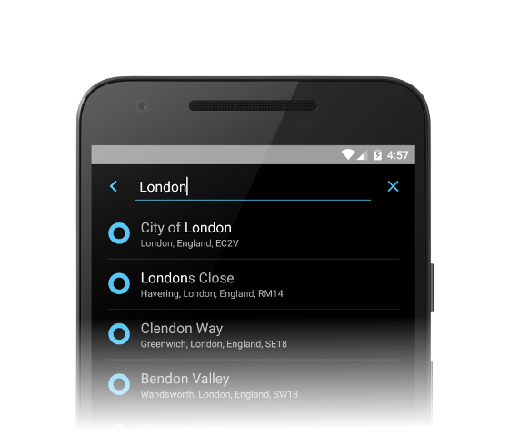

# Ordnance Survey Java and Android Search
Whether you are writing Java or Android code, we have you covered on both the front and back end to help create a great search experience.

It has automatic detection of latitude / longitude and British National Grid values - and can of course it can access our OS Open Names and OS Places APIs with your API Keys.

Best of all, the code is open source so that you can match it with your specific needs.  We of course welcome your pull requests with  any enhancements.

