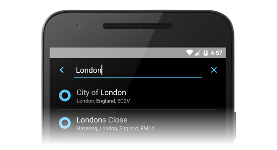
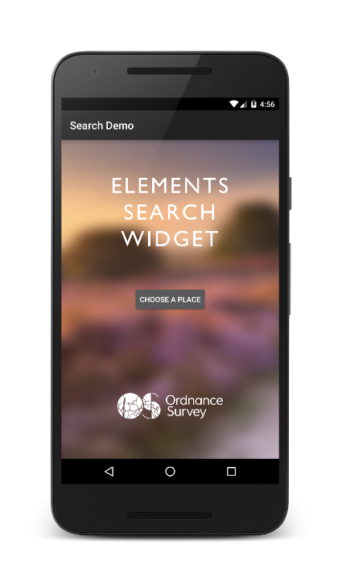
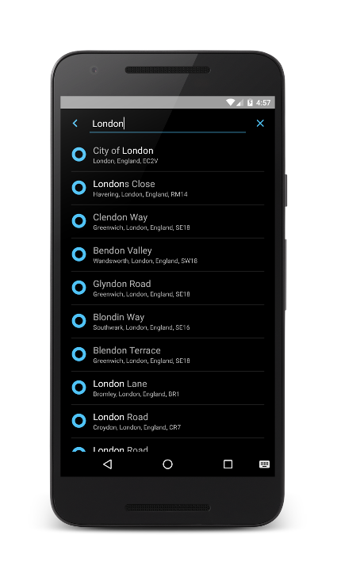

# Ordnance Survey Java and Android Search
Whether you are writing Java or Android code, we have you covered on both the front and back end to help create a great search experience.

It has automatic detection of latitude / longitude and British National Grid values - and can of course it can access our [OS Open Names](https://www.ordnancesurvey.co.uk/business-and-government/products/os-open-names-api.html) and [OS Places](https://www.ordnancesurvey.co.uk/business-and-government/products/os-places/) APIs with your API Keys.

Best of all, the code is open source so that you can match it with your specific needs.  We of course welcome your pull requests with  any enhancements.

# Code #

**Master Build Status:** 

**Test Coverage:** 
 

The library can be used directly from [Java](/search-java/README.md) or [Android](/search-android/README.md).  Once configured, you should be able to test using these example queries:

* SU41
* SU4010
* SU400100
* SU40001000
* 51.50722, -0.1275
* 51.50722 -0.1275
* 51°N 0°E
* 51°30'N 0°07'W
* 51°30'26.0"N 0°07'39.0"W
* 51° 30' 26" N, 0° 7' 39" W
* 51:30.433, -0:7.65
* 51:30:26.0 -0:07:39.0
* Edinburgh
* London Road, Southampton
* 10 Downing Street, London

(commas and spaces can be used interchangeably)

Examples of output:

 * *name* 51°30'26.0"N 0°07'39.0"W *context* 51.507220 -0.127500
 * *name* SU 4000 1000 *context* Easting: 440000  Northing: 110000
 * *name* SU 400 100 *context* Easting: 440000  Northing: 110000
 * *name* SU4010 *context* Easting: 440000  Northing: 110000
 * *name* SU41 *context* Easting: 440000  Northing: 110000
 * *name* Edinburgh *context* Edinburgh, Scotland, EH1
 * *name* London Road *context* Southampton, South East, England, SO15
 * *name* 10 DOWNING STREET *context* LONDON, CITY OF WESTMINSTER, SW1A 2AA

# Maintainer Repo Configuration #
The repository is integrated with CircleCI and therefore no manual
configuration is necessary.

Should manual configuration become necessary, the maintainer should consider
adding the following to their properties file:

    ~/.gradle/gradle.properties
       mavenUser=SonatypeNexusUser
       mavenPassword=SonatypeNexusPassword
       signing.keyId=mykeyabcd12345abcd
       signing.password=mykeyringpassword
       signing.secretKeyRingFile=/Users/my_username/.gnupg/secring.gpg

If you are working on a CI environment, such as CircleCI, you can specify
gradle environmental variables using the "ORG_GRADLE_PROJECT" prefix:

    export ORG_GRADLE_PROJECT_mavenUser="nexusUser"
    export ORG_GRADLE_PROJECT_mavenPassword="nexusPassword"

